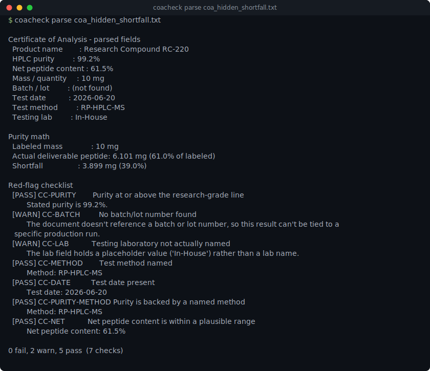

# coacheck

[](https://github.com/munzzyy/coacheck/actions/workflows/ci.yml)
[](LICENSE)
[](pyproject.toml)



This is an informational parsing and calculator tool. It does not endorse, recommend, source, or
facilitate the purchase of any compound, and nothing here is medical advice.

coacheck reads a Certificate of Analysis (COA) - the lab report that ships with a research
peptide vial - and does three things with it: extracts the fields (purity, batch number, test
method, and so on) with regex, checks that the document contains what a COA is supposed to
contain, and does the arithmetic to turn a labeled mass into a real deliverable mass and a
reconstituted vial into a syringe draw. It doesn't judge whether to use anything; it does the
math on what you give it.

## Install

Pure standard library, Python 3.9+, no runtime dependencies. Clone it and it runs:

```bash
git clone https://github.com/munzzyy/coacheck
cd coacheck
python -m coacheck parse tests/fixtures/coa_clean.txt   # run it directly, no install
pip install -e .                                        # or install the `coacheck` command
```

## Usage

### Parsing a COA

```
$ coacheck parse tests/fixtures/coa_clean.txt
Certificate of Analysis - parsed fields
  Product name        : Research Compound RC-118
  HPLC purity         : 99.1%
  Net peptide content : 91.5%
  Mass / quantity     : 5 mg
  Batch / lot         : RC118-20260214-A
  Test date           : 2026-02-14
  Test method         : RP-HPLC-MS
  Testing lab         : Meridian Analytical Labs

Purity math
  Labeled mass              : 5 mg
  Actual deliverable peptide: 4.534 mg (90.7% of labeled)
  Shortfall                 : 0.466 mg (9.3%)

Red-flag checklist
  [PASS] CC-PURITY        Purity at or above the research-grade line
         Stated purity is 99.1%.
  [PASS] CC-BATCH         Batch/lot number present
         Batch/lot: RC118-20260214-A
  [PASS] CC-LAB           Testing laboratory named
         Lab: Meridian Analytical Labs
  [PASS] CC-METHOD        Test method named
         Method: RP-HPLC-MS
  [PASS] CC-DATE          Test date present
         Test date: 2026-02-14
  [PASS] CC-PURITY-METHOD Purity is backed by a named method
         Method: RP-HPLC-MS
  [PASS] CC-NET           Net peptide content is within a plausible range
         Net peptide content: 91.5%

0 fail, 0 warn, 7 pass  (7 checks)
```

`coacheck parse` reads from a file, or from stdin if you leave the path off:

```bash
cat some-coa.txt | coacheck parse
```

Pass `--json` for machine-readable output:

```bash
coacheck parse tests/fixtures/coa_clean.txt --json
```

### Reconstitution math

```
$ coacheck recon --vial 5 --water 2 --dose 250
Reconstitution
  Vial                : 5 mg
  Bacteriostatic water: 2 mL
  Concentration       : 2500 mcg/mL
  Dose                : 250 mcg
  Draw                : 0.1000 mL (10.0 units on a U-100 insulin syringe)
  Doses per vial      : 20.00
```

`--dose` is in mcg by default; pass `--unit mg` if you'd rather give it in mg. `--json` works
here too.

## What it checks / does

- Parses a COA text blob for product name, HPLC purity, net peptide content, mass/quantity,
  batch/lot number, test date, test method, and testing lab, tolerating the label wording real
  vendor documents vary ("Purity", "HPLC Purity", "Purity (HPLC)", dash or colon separators,
  case-insensitive). See [docs/checks.md](docs/checks.md) for the exact formulas.
- Computes actual deliverable peptide mass from labeled mass, purity, and (if stated) net
  peptide content, plus the shortfall against the label in both mg and percent.
- Runs a 7-item red-flag checklist (`CC-PURITY`, `CC-BATCH`, `CC-LAB`, `CC-METHOD`, `CC-DATE`,
  `CC-PURITY-METHOD`, `CC-NET`), each a stable id with a pass/warn/fail status, documented in
  [docs/checks.md](docs/checks.md).
- Computes reconstitution math: concentration, mL to draw, units on a U-100 insulin syringe, and
  doses per vial, from a vial mass, diluent volume, and a dose you supply.

## What it does not do

- It does not verify that a COA is genuine. A fabricated document can fill in every field with
  invented numbers and pass every check here; this tool checks for missing or impossible data,
  not for forgery.
- It does not check a batch number, lab name, or test date against any outside registry. Every
  field is taken at face value from the text you give it.
- It does not recommend a dose, a product, or a source. `recon` computes whatever `--dose` you
  pass it; it has no opinion on what that number should be.
- It's a regex parser over plain text. It doesn't do OCR, doesn't read PDFs or images, and can
  miss a field worded in a way none of its label patterns cover - see
  [CONTRIBUTING.md](CONTRIBUTING.md) if you hit one.
- No network calls, no telemetry, nothing phones home.

## Exit codes

- `0` - ran to completion. This is independent of the red-flag results: a report full of FAIL
  flags still exits `0`, because a failed check is information, not a tool error.
- `1` - invalid input: unparseable arguments to `recon`'s math, or a COA text blob that's
  oversized or the wrong type.
- `2` - couldn't read the input at all (file not found) or a command-line usage error.

## Contributing

See [CONTRIBUTING.md](CONTRIBUTING.md). New label variants and new checks land with a test.

## License

MIT — free to use, change, and ship, commercial or not. See [LICENSE](LICENSE).